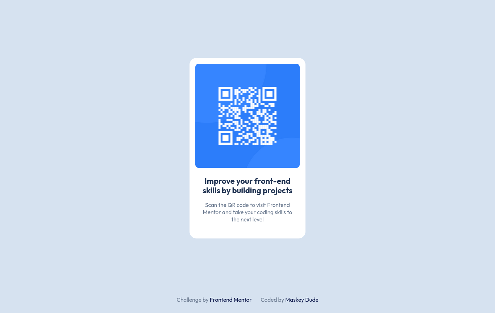

# Frontend Mentor - QR code component solution

The challenge... [QR code component challenge on Frontend Mentor](https://www.frontendmentor.io/challenges/qr-code-component-iux_sIO_H)

## Table of contents
  - [Screenshot](#screenshot)
  - [Links](#links)
  - [Built with](#built-with)
  - [What I learned?](#what-i-learned?)
  - [Continued development](#continued-development)
- [Author](#author)

### Screenshot

Desktop Version

Mobile Version

### Links

- Solution URL: [Add solution URL here](https://your-solution-url.com)
- Live Site URL: [Add live site URL here](https://your-live-site-url.com)

## Built with

- HTML
- CSS

### What I learned?

That learning path in frontend mentor is really useful ...

### Continued development

Just tryna complete more like explore the learning path in frontendo yay...
ou look back on this project in the future.**

## Author

- Website - [OmerM](https://www.omerm.42web.io/index.html?i=1)
- Frontend Mentor - [@MaskeyDude](https://www.frontendmentor.io/profile/MaskeyDude)
